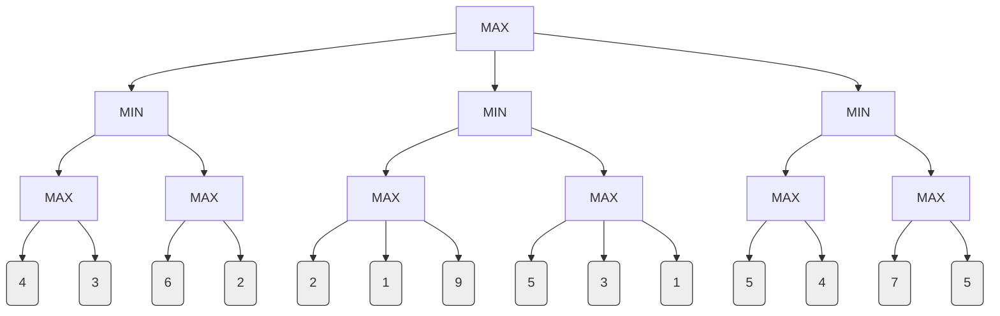

The Minimax algorithm is a recursive, decision-making algorithm used in two-player, zero-sum games to determine the optimal move. It explores the entire game tree using a depth-first search approach. The algorithm assumes that both players play optimally. The key properties of the Minimax algorithm are:

- **Completeness:** The Minimax algorithm is complete if the game tree is finite. This means it is guaranteed to find a solution if one exists.
- **Optimality:** It is optimal against an optimal opponent. If the opponent plays to minimize the score, Minimax will find the move that maximizes the score.
- **Time Complexity:** The time complexity is O(bm), where 'b' is the branching factor (number of legal moves from a position) and 'm' is the maximum depth of the tree. It explores every node in the game tree.
- **Space Complexity:** The space complexity is O(bm) for a standard implementation, as it needs to store the path from the root to the current leaf during its depth-first exploration

---
**Question: Illustrate the working of the Minimax search procedure with an example.** (From Dec 2022 paper)

**Answer Format for 7 Marks:**

The Minimax algorithm is a fundamental search procedure for adversarial, two-player games. It determines the optimal move for a player (called MAX) by assuming the opponent (called MIN) also plays optimally to minimize MAX's score. The algorithm performs a complete depth-first exploration of the game tree.

**Minimax Procedure:**

The algorithm recursively calculates the "minimax value" for each node in the game tree. The minimax value of a node is the utility (score) of the corresponding state, assuming both players play optimally from that point onwards.

The procedure is as follows:

1. Generate the complete game tree from the current state down to the terminal states.
    
2. Apply a utility function to the terminal states to get their scores.
    
3. Work backward from the leaf nodes to the root, calculating the minimax value for each node:
    
    - If a node is a **MAX node**, its value is the **maximum** of its children's values.
        
    - If a node is a **MIN node**, its value is the **minimum** of its children's values.
        
4. At the root node, MAX chooses the move that leads to the child node with the highest minimax value.
    

**Example:**

Consider the following two-ply game tree where it is MAX's turn to move from the root node A. The values at the leaf nodes represent the utility for MAX.

```
      MAX 👑 (A)
      / | \
     /  |  \
MIN 🛡️(B) MIN 🛡️(C) MIN 🛡️(D)
  /|\     /|\     /|\
 / | \   / | \   / | \
3  12 8  2  4  6  14 5  2   <-- Terminal Utilities
```

**Step-by-Step Execution:**

1. **Evaluate MIN Node B:** This is a MIN level. MIN will choose the move that leads to the lowest score.
    
    - `Minimax(B) = min(3, 12, 8) = 3`. The value 3 is backed up to node B.
        
2. **Evaluate MIN Node C:** This is also a MIN level.
    
    - `Minimax(C) = min(2, 4, 6) = 2`. The value 2 is backed up to node C.
        
3. **Evaluate MIN Node D:** This is the final MIN level node.
    
    - `Minimax(D) = min(14, 5, 2) = 2`. The value 2 is backed up to node D.
        

The tree now looks like this with the backed-up values:

```
      MAX 👑 (A)
      / | \
     /  |  \
MIN 🛡️(B) MIN 🛡️(C) MIN 🛡️(D)
 value=3  value=2  value=2
```

4. **Evaluate MAX Node A (Root):** This is a MAX level. MAX will choose the move that leads to the highest score among its children's values.
    
    - `Minimax(A) = max(value of B, value of C, value of D)`
        
    - `Minimax(A) = max(3, 2, 2) = 3`.
        

**Conclusion:** The minimax value of the root node A is 3. Therefore, the optimal move for MAX is to choose the action `a1`, which leads to node B, as this guarantees a score of at least 3, assuming MIN plays optimally to minimize the score.

**Limitation:** The primary drawback of the Minimax algorithm is its exponential time complexity of O(bm), which makes it impractical for complex games with large branching factors and depths, such as chess. It explores nodes that may be irrelevant to the final decision.

---


![[Pasted image 20251013000529.png]]
![[Pasted image 20251013000612.png]]
![[Pasted image 20251013000641.png]]
![[Pasted image 20251013000747.png]]
![[Pasted image 20251013000753.png]]
![[Pasted image 20251112195559.png]]
![[Pasted image 20251013001041.png]]
![[Pasted image 20251013001029.png]]

![[Pasted image 20251012235626.png]]
![[Pasted image 20251013002057.png]]

- **two players** : 
	  MAX : wants max benefits
	  MIN : wants min benefits 

![[Pasted image 20251013001115.png]]
![[Pasted image 20251013001500.png]]
![[Pasted image 20251013001547.png]]


### PYQ 


**Problem:** Perform Minimax search on the following game tree, where MAX plays first. The values at the bottom are the utility scores from the terminal states.

#### Step-by-Step Solution:

We solve this from the bottom up.

**Step 1: Apply rules to the bottom-most MAX layer.** These nodes are MAX nodes, so they take the _maximum_ value of their children.

- max(4, 3) = **4**
    
- max(6, 2) = **6**
    
- max(2, 1, 9) = **9**
    
- max(5, 3, 1) = **5**
    
- max(5, 4) = **5**
    
- max(7, 5) = **7**
    

The tree now looks like this:

**Step 2: Apply rules to the MIN layer.** These nodes are MIN nodes, so they take the _minimum_ value of their newly calculated children.

- min(4, 6) = **4**
    
- min(9, 5) = **5**
    
- min(5, 7) = **5**
    

The tree now looks like this:

**Step 3: Apply rule to the Root (MAX) node.** The root is a MAX node, so it takes the _maximum_ value of its children.

- max(4, 5, 5) = **5**
    

#### Conclusion:

- The **Minimax value** of the game is **5**.
    
- This means if MAX plays optimally, and MIN also plays optimally, MAX can **guarantee a score of at least 5**.
    
- **The optimal move for MAX** is to choose the middle (or right) path, as this leads to the node with the value of 5.

## Properties of MIN-MAX
> **⭐ Exam Focus:** This is a good 3-mark or 6-mark question.

- **Completeness:** **Yes**, if the game tree is finite.
    
- **Optimality:** **Yes**, if the opponent is also playing optimally.
    
- **Time Complexity:** **$O(b^m)$**. (where $b$ is the branching factor and $m$ is the maximum depth). This is terrible for large games.
    
- **Space Complexity:** **$O(bm)$** (if using a depth-first traversal).
    

Because the time complexity is so high, Minimax is rarely used in its pure form. It is almost always optimized with **Alpha-Beta Pruning**, which is the next topic in your module.