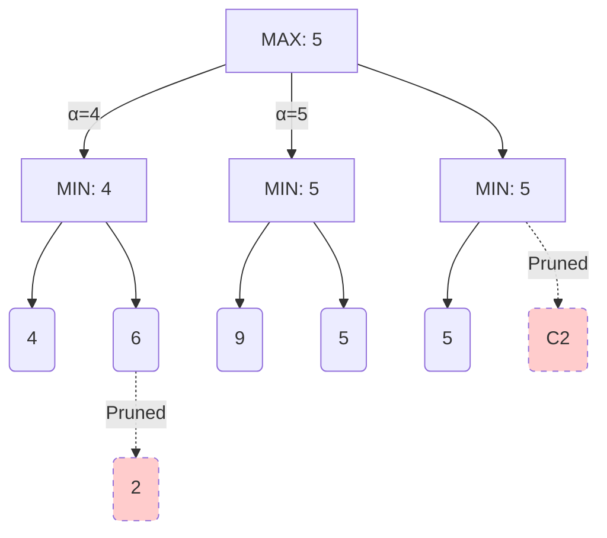

![[Pasted image 20251013003717.png]]
![[Pasted image 20251013003725.png]]
![[Pasted image 20251013003802.png]]
![[Pasted image 20251013003825.png]]

```mermaid
graph TD
    Root[MAX: 5] -->|α=4| A[MIN: 4]
    Root -->|α=5| B[MIN: 5]
    Root --> C[MIN: 5]

    A --> A1(4)
    A --> A2(6)
    A2 -.->|Pruned| X(2)
    style X stroke-dasharray: 5 5, fill:#ffcccc

    B --> B1(9)
    B --> B2(5)

    C --> C1(5)
    C -.->|Pruned| C2(C2)
    style C2 stroke-dasharray: 5 5, fill:#ffcccc
```
